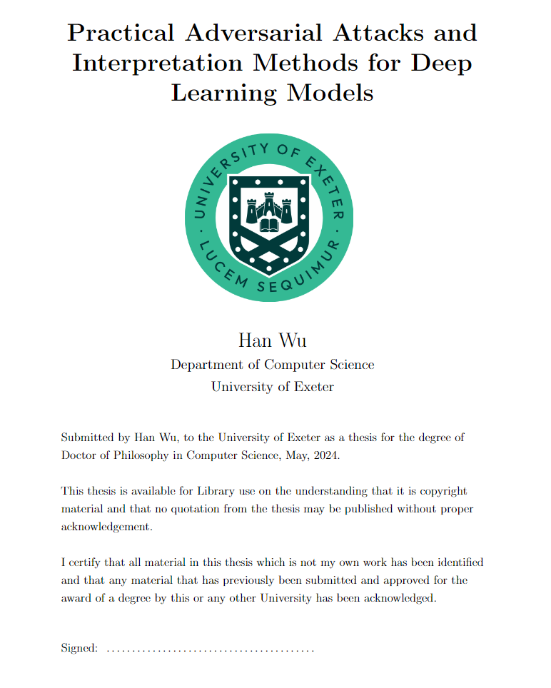

# University of Exeter

> Practical Adversarial Attacks and Interpretation Methods for Deep Learning Models

Based on [George's template](https://github.com/georgedeath/University_of_Exeter_Thesis_Template), I added the university logo and header.

### Thesis Compiling

```
$ sudo apt install texlive-base texlive-latex-base
$ tlmgr install scheme-full
$ tlmgr path add

$ sudo apt-get install latex-cjk-all
$ tlmgr install cjk
$ updmap -user

> pdflatex Thesis.tex
> biber Thesis
> makeglossaries Thesis
> pdflatex Thesis.tex
> pdflatex Thesis.tex
```

### Useful Tools

- Export only cited references:

```
biber --output_resolve <filename>.bcf --output_format=bibtex
```

- Cleaner and Formatter for BibTeX files.

  https://flamingtempura.github.io/bibtex-tidy/

- After cleaning up, it's easier to find duplicated references.



<hr />

From George De Ath:

This is a minimum working example of a template that adheres to the
[University guidelines](http://as.exeter.ac.uk/academic-policy-standards/tqa-manual/pgr/presentationoftheses/)
as of 11/12/2019. 

The template was the basis of my 
[PhD thesis](https://ore.exeter.ac.uk/repository/handle/10871/38781) 
and it was submitted with only minor alterations to it.

In order to edit the information on the title page, e.g. the thesis title,
change the contents of the macros starting with `\thesis` (line 114).

Note: the template does not use the *correct* font according to the guidelines
(Size 12 in Arial) as the general consensus is that using Arial is 
unprofessional -- no issues were raised with the font change.

To compile the file use the following commands in the command line:
```console
> pdflatex Thesis.tex
> bibtex Thesis
> pdflatex Thesis.tex
> pdflatex Thesis.tex
```
